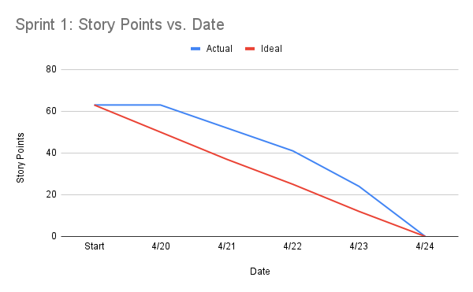
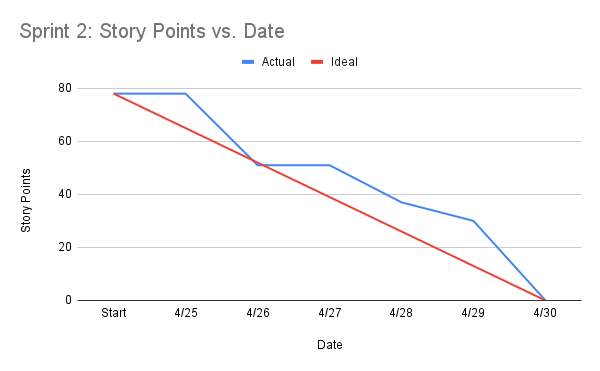
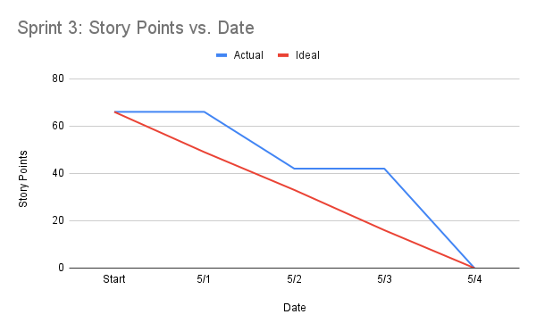

# Project Journal

## Overview

This journal keeps our weekly Scrum reports for the CMPE 202 EventHub project. EventHub is an event app with role-based login, event creation and browsing, RSVP support, notifications, calendar and map features, and AWS deployment with auto scaling.

Across the sprints, we moved from planning, diagrams, wireframes, and database setup to full-stack features, API validation, role-based access, RSVP, notifications, integrations, AWS deployment, and final demo work.

## Scrum Backlog and Burndown Tracking

The team maintained the Scrum backlog in GitHub Projects: [EventHub SJSU Scrum Backlog](https://github.com/orgs/gopinathsjsu/projects/154/views/1).

Story point tracking and burndown chart source data were maintained in Google Sheets: [CMPE202 Burndown Sheet](https://docs.google.com/spreadsheets/d/1RVm_heL87TRjrHEN_H4J3Goh07gKo1lJHJvYNI6tYK0/edit?usp=sharing).

### Sprint 1 Burndown Chart

### Sprint 2 Burndown Chart

### Sprint 3 Burndown Chart

## Major Milestones

- Completed project structure, architecture notes, database design, and wireframes.
- Implemented authentication with password hashing, JWT generation and verification, protected routes, and role-based access control for attendees, organizers, and admins.
- Built event CRUD APIs, event listing and detail pages, search and filters, capacity logic, and RSVP features.
- Added organizer and admin features, including attendee management, event approval, rejection, deletion, and visibility rules.
- Implemented email notifications, RSVP cancellation notifications, event deletion notifications, and scheduled event reminders.
- Added Google Calendar and Google Maps integrations.
- Completed AWS deployment using EC2, Nginx, AMI, Auto Scaling Group, and Application Load Balancer.

## XP Core Values

### Communication

We followed the XP value of communication by having regular Scrum meetings. In each meeting, we shared what we finished, what we would do next, and any blockers. This helped us stay on the same page and avoid doing the same work.

We split our work based on our roles. Alicia worked on project planning, component and deployment diagrams, backlog and sprint setup, authentication, protected routes, API validation, role-based access control, frontend integration, RSVP features, create and update event features, attendee/organizer/admin dashboards, attendee management, testing, documentation, and UI improvements. Anandita worked on wireframes, database setup, Supabase migration, event APIs, search and filter features, notifications, and Google Calendar and Google Maps integrations. We worked together on deployment. By talking often, we could see dependencies early. For example, we first used in-memory storage for authentication, then moved to the database later. We also made sure backend APIs were ready before connecting the frontend.

We also used communication to keep our documents updated. We kept track of architecture, database design, and Scrum notes as the project changed. This made it easier to explain our work during Demo Day.

### Respect

We showed respect by taking responsibility for our own parts while helping each other when needed. Each part of the system depended on the others. The frontend needed the backend, the backend needed the database, and deployment needed everything to work together.

When we had blockers, we worked together to fix them. We did not blame each other. For example, we used in-memory storage first and moved to Supabase later when it was ready.

We also respected users by improving the quality of our app. Before the final demo, we worked on validation, error handling, role-based access, notifications, and UI clarity. This helped make the app more reliable and easier to use.

## Sprint 1

### April 20, 2026 - Scrum Meeting 1

#### Alicia

- **Completed**
  - First meeting, so no implementation tasks were completed yet.
  - Documented the initial project plans.
- **Next**
  - Start setting up the project structure.
- **Blockers**
  - No major blockers.

#### Anandita

- **Completed**
  - First meeting, so no implementation tasks were completed yet.
- **Next**
  - Draw wireframes.
- **Blockers**
  - No major blockers.

### April 22, 2026 - Scrum Meeting 2

#### Alicia

- **Completed**
  - Finalized the project folder structure with initial placeholder files.
  - Defined API naming conventions.
  - Completed the frontend and backend architecture.
  - Designed the component diagram and deployment diagram.
  - Documented `PROJECT_STRUCTURE.md` and `DB_DESIGN.md` to track project structure and database design.
- **Next**
  - Finish setting up the frontend.
  - Integrate APIs and test them.
  - Start JWT authentication.
- **Blockers**
  - No major blockers.

#### Anandita

- **Completed**
  - Created wireframes for all pages.
- **Next**
  - Download and set up SQL tooling for the schema.
  - Set up the backend environment.
- **Blockers**
  - No major blockers.

### April 24, 2026 - Scrum Meeting 3

#### Alicia

- **Completed**
  - Completed frontend setup with routing based on the wireframes.
  - Implemented the API structure for authentication.
  - Implemented password hashing using bcrypt.
  - Implemented JWT generation and verification.
  - Created authentication middleware for protected routes.
  - Implemented register and login APIs using mock in-memory storage.
  - Successfully tested authentication APIs using Postman, including register, login, error cases, and protected routes.
  - Verified the end-to-end authentication flow from request to controller to response.
- **Next**
  - Begin connecting frontend pages to backend APIs.
  - Start UI implementation.
  - Start event validation.
- **Blockers**
  - No major blockers.
  - Backend currently uses in-memory storage. Waiting for database setup before switching to persistent storage.

#### Anandita

- **Completed**
  - Configured environment variables in `.env`.
  - Set up PostgreSQL locally.
  - Tested authentication and event controllers/routes.
  - Finished backend environment setup.
  - Set up the `eventhub_sjsu` database connection.
  - Created database tables for users, events, registrations, and notifications.
  - Designed and implemented the database schema and constraints.
  - Tested the database manually.
- **Next**
  - Move the database to Supabase instead of a local setup.
  - Move on to Sprint 2 tasks.
- **Blockers**
  - No major blockers.

## Sprint 2

### April 26, 2026 - Scrum Meeting 4

#### Alicia

- **Completed**
  - Implemented the login UI and basic page UIs based on the wireframes.
  - Integrated the frontend with the backend login API.
  - Implemented event API validation:
    - Required field validation.
    - Date and time format validation.
    - Capacity validation.
  - Integrated authentication middleware into event routes so JWT authentication is required for create and update operations.
  - Implemented role-based access control by restricting event create and update operations to organizer and admin roles.
- **Next**
  - Continue frontend integration:
    - Implement protected routes in the frontend.
    - Build the event listing UI (`EventListPage`).
    - Connect the frontend to backend APIs.
  - Continue API testing with frontend integration.
- **Blockers**
  - No major blockers.

#### Anandita

- **Completed**
  - Migrated the project to Supabase instead of local PostgreSQL.
  - Implemented event CRUD functionality.
  - Implemented the get event API.
  - Implemented the create event API.
  - Implemented the update event API.
  - Implemented the delete event API.
- **Next**
  - Complete tasks for Sprint 2 Meeting 5:
    - Event detail API.
    - Organizer information.
    - Capacity logic.
    - Keyword search API.
    - Category, date, and location filters.
    - RSVP API.
- **Blockers**
  - No blockers.

### April 28, 2026 - Scrum Meeting 5

#### Alicia

- **Completed**
  - Implemented the event listing page UI to reflect database data.
  - Connected the register and login pages with the database.
  - Added more protected routes.
  - Tested all APIs.
- **Next**
  - Continue frontend integration:
    - Build the RSVP page UI.
    - Prevent RSVP edge cases.
  - Continue edge case testing.
- **Blockers**
  - No major blockers.

#### Anandita

- **Completed**
  - Worked on search and filter conditions:
    - Keyword search API.
    - Category filter.
    - Date filter.
    - Location filter.
  - Reviewed the SQL database and cleaned up typos in table attributes.
- **Next**
  - Work on the event detail API:
    - Capacity logic.
    - Include organizer information.
    - Review whether additional work is needed for the RSVP API.
- **Blockers**
  - No major blockers.

### April 30, 2026 - Scrum Meeting 6

#### Alicia

- **Completed**
  - Implemented RSVP APIs:
    - Users can register for events.
    - Duplicate registrations are prevented.
    - Event capacity limits are enforced.
  - Implemented organizer-related APIs:
    - Attendee list API for the organizer dashboard.
    - Organizer events API to fetch events created by the organizer.
  - Implemented admin-only endpoints:
    - Approve, reject, and delete event workflow.
  - Completed role-based access control:
    - Restricted event create, update, and delete operations to organizers and admins.
  - Completed frontend integration:
    - Event listing UI with real backend data.
    - Event detail UI with real backend data.
    - RSVP UI integration.
    - Dashboard UI integration with different views for attendees, organizers, and admins.
  - Completed edge case testing.
- **Next**
  - Continue frontend integration:
    - Polish the UI.
    - Add event filtering.
  - Continue testing.
- **Blockers**
  - No major blockers.

#### Anandita

- **Completed**
  - Worked on the event detail API:
    - Included organizer information.
    - Created capacity logic.
    - Updated the `is_full` value to better indicate why an event is full.
    - Returned whether an event is registerable.
    - Renamed `register_count` to `active_registration_count` to clarify the variable purpose.
    - Updated `getAllEvents` to match `getEventID`.
- **Next**
  - Start the notification system:
    - Event reminders.
    - Registration notifications.
    - Event approval and rejection notifications.
    - Event deletion notifications.
    - Unregistered-from-event notifications.
  - Start setting up AWS for deployment.
- **Blockers**
  - No major blockers.

## Sprint 3

### May 2, 2026 - Scrum Meeting 7

#### Alicia

- **Completed**
  - Completed admin features:
    - Reject event.
    - Event approval workflow.
    - Enforced visibility rules based on approval status and user roles.
  - Enforced role-based access control across all APIs:
    - Ensured correct protection for public, authenticated attendee, organizer, and admin endpoints.
  - Improved API validation:
    - Added validation for route parameters such as event IDs.
    - Added numeric validation for capacity and ticket price.
  - Improved error handling consistency:
    - Standardized 400, 401, 403, and 404 responses.
    - Implemented a global error handler for safe 500 responses.
- **Next**
  - Complete final UI polish and improvements.
  - Enhance the user experience.
  - Add filtering.
  - Prepare for the final demo:
    - Full user flow walkthrough from login to browse, event detail, RSVP, and admin approval.
    - Final end-to-end verification.
- **Blockers**
  - No major blockers.

#### Anandita

- **Completed**
  - Implemented the notification system:
    - Installed email dependency.
    - Created a new email account for notifications.
    - Added email variables to the environment configuration.
    - Created utility files for `emailService` and `notificationService`.
    - Called the notification service from `eventController` for RSVP, event approval, and event rejection.
    - Tested whether the email service was working.
    - Included error handling for notifications that are not sent properly.
  - Worked on AWS deployment:
    - Created an AWS account.
    - Set up EC2.
    - Set up Auto Scaling.
- **Next**
  - Implement map integration.
  - Implement calendar integration.
  - Implement the reminder system to alert attendees one day before an event.
  - Finish AWS deployment.
  - Complete final bugs and fixes.
- **Blockers**
  - No major blockers.

### May 4, 2026 - Scrum Meeting 8

#### Alicia

- **Completed**
  - Updated events to be free only.
  - Allowed organizers to update events.
  - Upgraded and cleaned up the UI.
  - Allowed organizers to manage attendees for their events.
- **Next**
  - Prepare all documents.
  - Help with deployment.
  - Prepare for the final demo:
    - Full user flow walkthrough from login to browse, event detail, RSVP, and admin approval.
    - Final end-to-end verification.
- **Blockers**
  - No major blockers.

#### Anandita

- **Completed**
  - Implemented Google Calendar integration:
    - Generated calendar event links from the backend.
    - Added "Add to Google Calendar" functionality to the frontend on the event detail and RSVP pages.
  - Implemented Google Maps integration:
    - Created a reusable map component.
    - Embedded a location map on the event detail page.
    - Added a fallback "View on Google Maps" link.
  - Completed notification system enhancements:
    - Added email notifications for RSVP cancellation.
    - Added event deletion notifications for all attendees.
    - Implemented a scheduled event reminder system using a cron job to send reminders one day before an event.
  - Integrated notifications into relevant controller functions.
  - Began and progressed AWS deployment setup:
    - Launched an EC2 instance and configured the backend environment.
    - Installed Node.js dependencies and set up the backend server.
    - Configured an Nginx reverse proxy.
    - Created an AMI and Auto Scaling Group.
    - Set up an Application Load Balancer.
- **Next**
  - Finish AWS deployment.
  - Complete final bugs and fixes.
- **Blockers**
  - AWS deployment issue.
