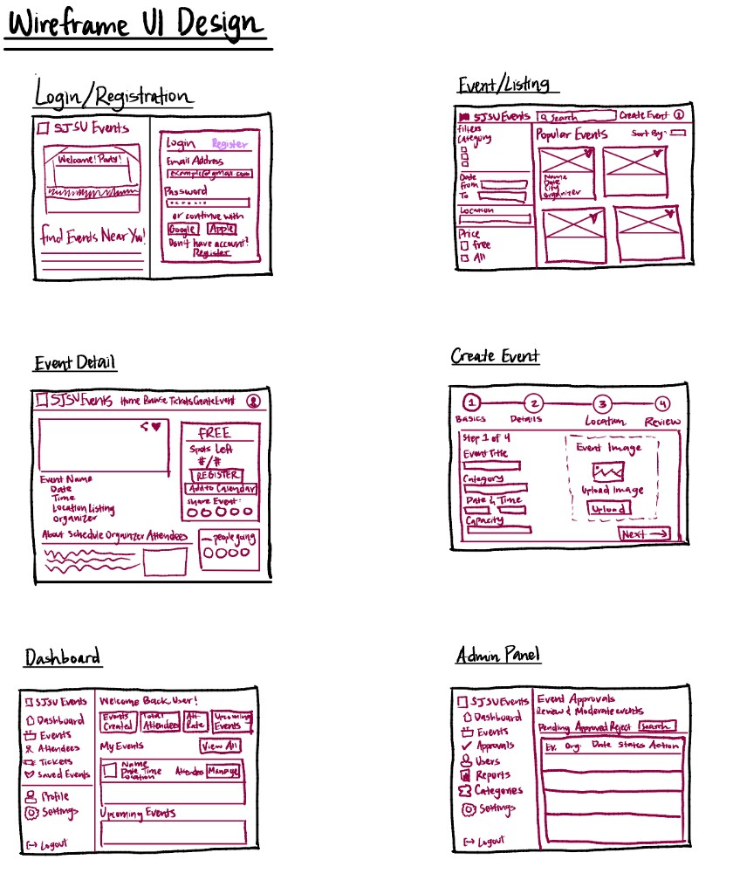
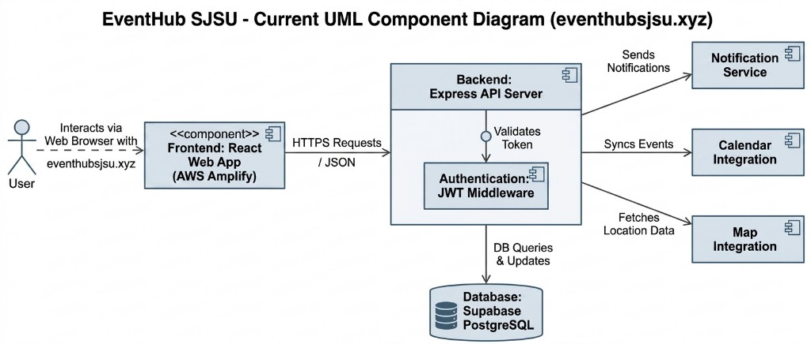
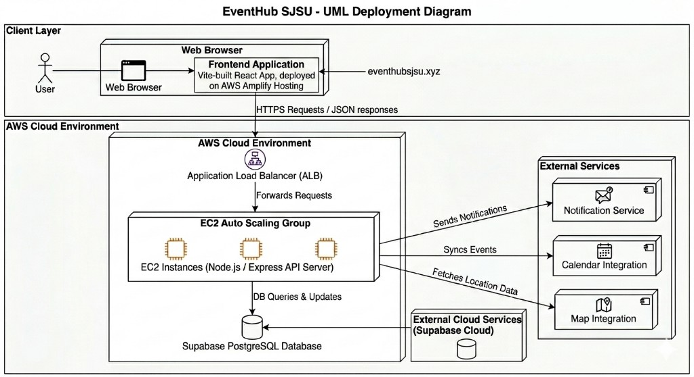

[](https://classroom.github.com/a/xRTHk3Dv)

# EventHub SJSU

EventHub SJSU is a full-stack event app where users can find, create, manage, and register for events. We built it for CMPE 202 using Scrum across multiple sprints.

## Team Information

**Team Name:** TripleA

**Team Members:**

- Alicia Kim
- Anandita

**Contribution Summary:**

- Alicia worked on project planning, sprint/backlog setup, API conventions, component and deployment diagrams, project documentation, and final documentation. She worked on authentication, protected routes, role-based access control, frontend integration, RSVP, organizer/admin workflows, attendee management, API validation, error handling, role-based dashboards, UI polish, and testing.
- Anandita worked on UI wireframes, backend environment setup, database setup, Supabase migration, event CRUD/detail APIs, organizer information, capacity logic, search and filter logic, notifications, email integration, Google Calendar, Google Maps, and AWS setup tasks.
- Both team members worked together on deployment and demo preparation.

**Project Journal:** [PROJECT_JOURNAL.md](https://github.com/gopinathsjsu/team-project-cmpe202-01-spring2026-triplea/blob/main/PROJECT_JOURNAL.md)

**Backlog and Sprint Tracking:**

- [GitHub Project Board](https://github.com/orgs/gopinathsjsu/projects/154/views/1)
- [Burndown and Story Point Google Sheet](https://docs.google.com/spreadsheets/d/1RVm_heL87TRjrHEN_H4J3Goh07gKo1lJHJvYNI6tYK0/edit?usp=sharing)
- Sprint burndown charts are included in [PROJECT_JOURNAL.md](https://github.com/gopinathsjsu/team-project-cmpe202-01-spring2026-triplea/blob/main/PROJECT_JOURNAL.md).

## Features

- Role-based authentication for attendees, organizers, and admins.
- User registration and login with bcrypt password hashing and JWT authentication.
- Event discovery with category, date, location, keyword search, and sorting support.
- Event detail pages with organizer information, capacity status, RSVP actions, Google Calendar links, and Google Maps support.
- Organizer workflows for creating events, updating events, viewing attendees, and removing attendees.
- Admin workflows for approving or rejecting events and reviewing event update requests.
- RSVP workflows with duplicate registration checks, cancellation, capacity checks, and attendee removal tracking.
- Email notifications for registration confirmations, approvals, rejections, reminders, cancellations, event deletion, and attendee removal.
- Scheduled event reminder job that runs before upcoming events.
- Supabase PostgreSQL database populated with mock users, events, registrations, and notifications for testing and demo use.
- Responsive web UI with accessibility-focused labels, spacing, contrast, and role-based navigation.
- AWS deployment using EC2, Nginx, AMI, Auto Scaling Group, and Application Load Balancer.

## Tech Stack

- Frontend: React, Vite, React Router.
- Backend: Node.js, Express.
- Database: PostgreSQL/Supabase using the `pg` client.
- Authentication: JWT, bcrypt.
- Notifications: Nodemailer, node-cron.
- Deployment: AWS EC2, Nginx, Auto Scaling Group, Application Load Balancer.

## Design Documentation

We created UI wireframes, a UML component diagram, and a UML deployment diagram to show how the app works.

### UI Wireframes

The wireframes cover the main screens in EventHub SJSU:

- Login and registration.
- Event listing with filters, search, and event cards.
- Event detail with RSVP, attendee count, schedule, organizer, and related event information.
- Multi-step create event flow.
- User dashboard for events, attendees, tickets, and saved events.
- Admin panel for event approvals, users, reports, categories, and settings.



### UML Component Diagram

The component diagram shows the React frontend communicating with the Express API server over HTTPS/JSON. The backend validates JWT tokens, reads and updates the Supabase PostgreSQL database, and connects to email, calendar, and map services.



### UML Deployment Diagram

The deployment diagram shows the production setup. The React app is hosted on AWS Amplify. API requests go through an AWS Application Load Balancer to EC2 instances running the Node.js/Express server. Supabase PostgreSQL stores the production data.



### Key Design Decisions

- Used React/Vite with React Router so attendees, organizers, and admins can move between pages clearly.
- Used an Express REST API with JWT middleware so protected routes can enforce role-based access.
- Moved from early in-memory storage to PostgreSQL/Supabase for users, events, registrations, notifications, and event update requests.
- Added event approval and update review workflows so admins control what is public while organizers can still manage their events.
- Added email notifications, scheduled reminders, Google Calendar links, and Google Maps support.
- Deployed the backend API with EC2, Nginx, AMI, Auto Scaling Group, and Application Load Balancer.

## Production Deployment

The production web UI is deployed with AWS Amplify:

- `https://main.d15ttj8ggeuben.amplifyapp.com`
- `https://eventhubsjsu.xyz`
- `https://www.eventhubsjsu.xyz`

The React/Vite frontend calls the deployed Express APIs through `VITE_API_BASE_URL`. The backend API runs on AWS EC2 instances behind an Application Load Balancer. Nginx sends requests to the Node.js/Express server, and Supabase PostgreSQL stores the production data.

## Repository Structure

```text
project-root/
  client/                 React + Vite frontend
  docs/diagrams/          UI wireframes, component diagram, and deployment diagram
  server/                 Express backend
  DB_DESIGN.md            Final database design documentation
  PROJECT_JOURNAL.md      Scrum meeting and sprint journal
  PROJECT_STRUCTURE.md    Project structure and folder guide
  README.md               Project overview and setup guide
```

See `PROJECT_STRUCTURE.md` for a more detailed folder-by-folder breakdown.

## Getting Started

Run the frontend and backend in separate terminals.

### Prerequisites

- Node.js and npm.
- PostgreSQL/Supabase database.
- Email SMTP account for notification testing.

### Environment Variables

Create `server/.env`:

```env
PORT=5000

DB_HOST=your-database-host
DB_PORT=5432
DB_NAME=your-database-name
DB_USER=your-database-user
DB_PASSWORD=your-database-password

JWT_SECRET=your-jwt-secret

EMAIL_HOST=your-smtp-host
EMAIL_PORT=587
EMAIL_SECURE=false
EMAIL_USER=your-email-user
EMAIL_PASS=your-email-password
EMAIL_FROM=your-sender-email
```

Optional frontend environment file, `client/.env`:

```env
VITE_API_BASE_URL=http://localhost:5000
VITE_GOOGLE_MAPS_API_KEY=your-google-maps-api-key
```

### Client (React + Vite)

```bash
cd client
npm install
npm run dev
```

`npm run dev` runs the Vite development server.

### Server (Express)

```bash
cd server
npm install
npm run dev
```

`npm run dev` runs the server with auto-restart on file changes.

## Production / Deploy Mode

### Server (Express)

```bash
cd server
npm install
npm start
```

`npm start` runs `node app.js` for production.

### Client Build

```bash
cd client
npm install
npm run build
```

`npm run build` creates the production frontend build in `client/dist`.

## Database

The final database schema is documented in:

- `server/models/schema.sql`
- `DB_DESIGN.md`

Main tables:

- `users`
- `events`
- `registrations`
- `notifications`
- `event_update_requests`

The schema includes user roles, event approval, event update requests, RSVP status, attendee removal reasons, notification types, calendar links, and map coordinates.

## API Overview

### Auth

- `POST /api/auth/register`
- `POST /api/auth/login`
- `GET /api/auth/profile`

### Events

- `GET /api/events`
- `GET /api/events/categories`
- `GET /api/events/:id`
- `POST /api/events`
- `PUT /api/events/:id`
- `DELETE /api/events/:id`
- `POST /api/events/:id/rsvp`
- `DELETE /api/events/:id/rsvp`
- `GET /api/events/:id/rsvp-status`

### Organizer and Admin

- `GET /api/events/my-events`
- `GET /api/events/my-registrations`
- `GET /api/events/:id/attendees`
- `DELETE /api/events/:id/attendees/:attendeeId`
- `GET /api/events/pending`
- `GET /api/events/all`
- `GET /api/events/admin/past`
- `PUT /api/events/:id/approve`
- `PUT /api/events/:id/reject`
- `GET /api/events/updates/pending`
- `GET /api/events/updates/my-rejected`
- `PUT /api/events/updates/:id/approve`
- `PUT /api/events/updates/:id/reject`

## Project Documentation

- `PROJECT_JOURNAL.md`: Sprint-by-sprint Scrum meeting records and individual contributions.
- `PROJECT_STRUCTURE.md`: Current frontend/backend structure and folder responsibilities.
- `DB_DESIGN.md`: Final database design, relationships, constraints, and business rules.
